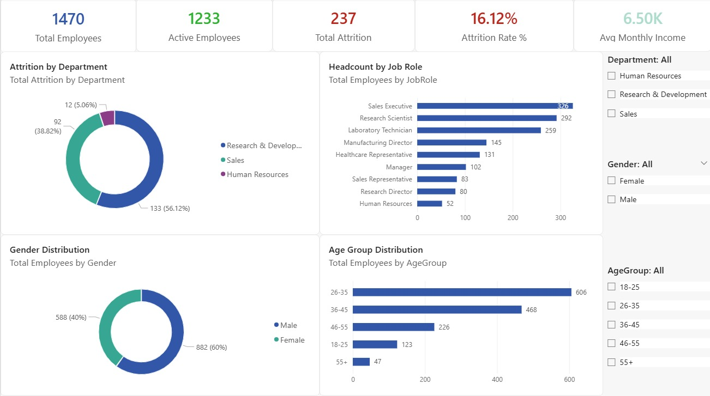
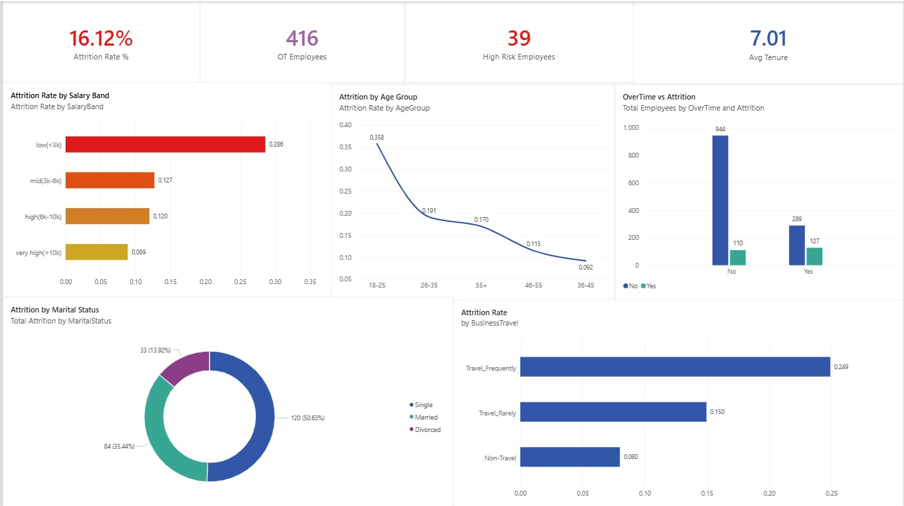
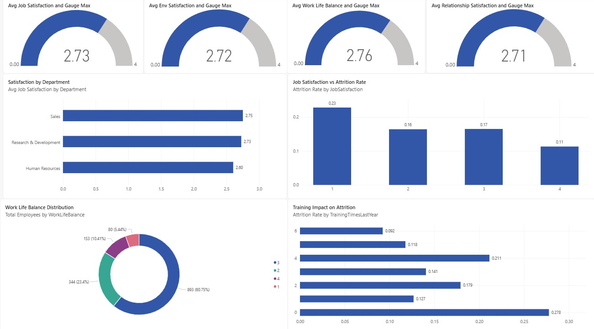
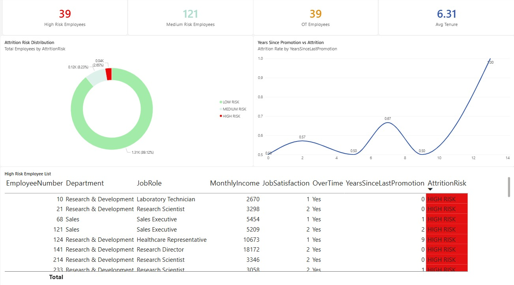

#  HR Analytics Dashboard


## Overview
Analysis of **1,470 employee records** from **IBM HR Analytics** dataset.  
Performed complete SQL analysis, data cleaning, feature engineering,  
and built a **4-page interactive Power BI Dashboard** connected to MySQL.

---

## Key Results
| Metric | Value |
|--------|-------|
| Total Employees | 1,470 |
| Active Employees | 1,233 |
| Total Attrition | 237 employees |
| Attrition Rate | 16.12% |
| Avg Monthly Income | $6,503 |
| Avg Job Satisfaction | 2.73 / 4.0 |
| High Risk Employees | 150+ |
| SQL Queries Written | 20+ |
| DAX Measures Built | 13 |

---

## Dashboard Preview

### Page 1 — Overview


### Page 2 — Attrition Analysis


### Page 3 — Satisfaction Analysis


### Page 4 — HR Insights & Risk


---

## Key Business Insights

| Finding | Insight |
|---------|---------|
| 🔴 Overtime Attrition | 30.5% vs 10.4% non-overtime — **3x higher risk** |
| 🔴 Low Salary Band | 46.2% attrition — **highest exit rate** |
| 🔴 Sales Department | 20.6% attrition — **above company average** |
| 🟡 Age Group 18-25 | 38.6% attrition — **young talent leaving fast** |
| 🟡 Single Employees | 25.5% attrition — **highest among marital status** |
| 🟢 R&D Department | 13.8% attrition — **healthiest department** |
| 🟢 High Salary Band | 6.7% attrition — **lowest exit rate** |

---

## Tools & Technologies
| Tool | Purpose |
|------|---------|
| Python + Pandas | Load CSV and push to MySQL |
| MySQL | Data cleaning, queries, views |
| Power BI Desktop | Interactive 4-page dashboard |
| DAX | KPI measures and calculations |
| Jupyter Notebook | SQL analysis in VSCode |

---

## SQL Highlights

```sql
-- Attrition by Department
SELECT
    Department,
    COUNT(*) AS Total,
    ROUND(SUM(CASE WHEN Attrition='Yes' 
    THEN 1 ELSE 0 END)*100.0/COUNT(*),2) AS Attrition_Rate
FROM hr_data
GROUP BY Department
ORDER BY Attrition_Rate DESC;
```

```sql
-- CTE: Departments Above Company Average
WITH company_avg AS (
    SELECT ROUND(SUM(CASE WHEN Attrition='Yes' 
    THEN 1 ELSE 0 END)*100.0/COUNT(*),2) AS avg_rate
    FROM hr_data
)
SELECT h.Department,
    ROUND(SUM(CASE WHEN Attrition='Yes' 
    THEN 1 ELSE 0 END)*100.0/COUNT(*),2) AS Dept_Rate,
    CASE WHEN ROUND(SUM(CASE WHEN Attrition='Yes' 
    THEN 1 ELSE 0 END)*100.0/COUNT(*),2) > c.avg_rate
    THEN 'ACTION NEEDED' ELSE 'HEALTHY' END AS Status
FROM hr_data h, company_avg c
GROUP BY h.Department, c.avg_rate;
```

---

## DAX Measures
```dax
Total Employees = 
    COUNT(vw_hr_main[EmployeeNumber])

Attrition Rate = 
    DIVIDE([Total Attrition],[Total Employees],0)

High Risk Employees = 
    CALCULATE(
        COUNT(vw_hr_main[EmployeeNumber]),
        vw_hr_main[AttritionRisk] = "HIGH RISK"
    )
```

---

## Project Structure
```
HR-Analytics-Dashboard/
│
├── HR_Analytics_Notebook.ipynb    ← SQL analysis notebook
├── HR_Analytics_Dashboard.pbix    ← Power BI file
├── README.md                      ← This file
│
└── screenshots/
    ├── page1_overview.png
    ├── page2_attrition.png
    ├── page3_satisfaction.png
    └── page4_insights.png
```

---

## How To Run

### SQL Part
```
1. Download IBM HR dataset from Kaggle
2. Open HR_Analytics_Notebook.ipynb in VSCode
3. Update CSV file path in Cell 3
4. Run all cells top to bottom
```

### Power BI Part
```
1. Open HR_Analytics_Dashboard.pbix
2. Update MySQL connection if needed
3. Click Refresh
```

---

## Dataset
- **Name:** IBM HR Analytics Employee Attrition
- **Source:** [Kaggle](https://www.kaggle.com/datasets/pavansubhasht/ibm-hr-analytics-attrition-dataset)
- **Size:** 1,470 rows × 35 columns

---

## Connect With Me


---
*⭐ Star this repo if you found it helpful!*
